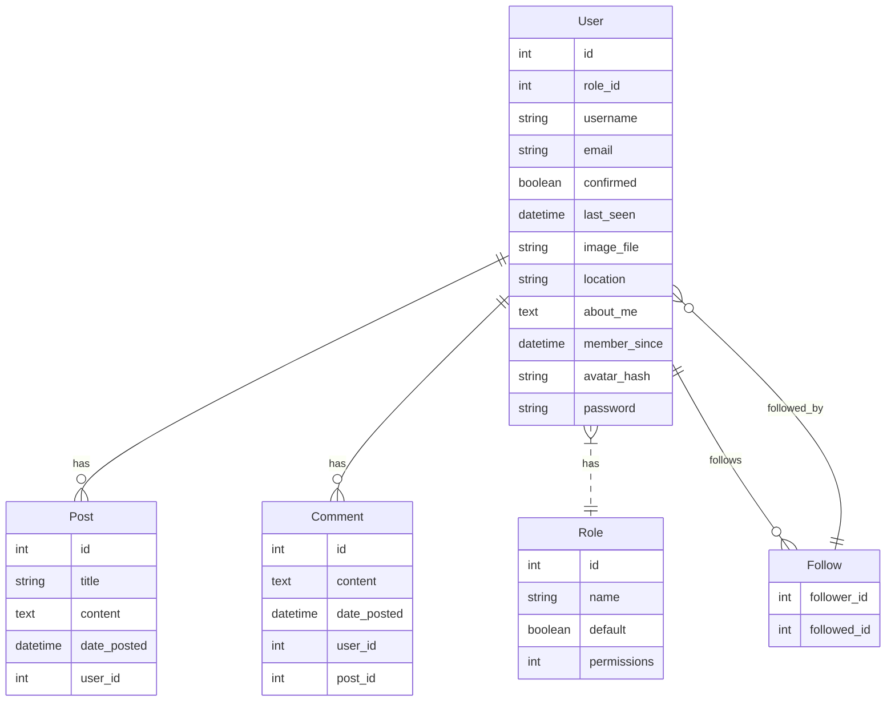

# FlaskBlog

FlaskBlog - это простой блог, созданный с помощью веб-фреймворка Flask.

## Описание проекта

FlaskBlog - это проект, который демонстрирует, как создать блог с помощью Flask. В этом проекте вы можете:

- Регистрироваться и входить в свой аккаунт
- Редактировать свой профиль и загружать аватар
- Подтверждать свой аккаунт по электронной почте
- Создавать, редактировать и удалять свои посты
- Просматривать посты других пользователей и оставлять комментарии
- Подписываться на других пользователей
- Другие пользователи могут подписываться на вас
- На главной странице вы можете просматривать либо все посты, либо посты тех людей, на которых вы подписаны
- На сайте есть админы и модераторы
- Админ может практически всё, кроме редактирования личной информации пользователя (админу нельзя менять юзернейм или email пользователя)
- Пароли пользователя хранятся в зашифрованном виде, никто их не может узнать, даже администратор сайта и разработчик :)
- (Скоро будет) Модераторы могут удалять комментарии
- (Когда-нибудь) Сделаем интеграцию с ChatGPT -just for fun :) 

## База данных
В данном разделе поговорим о базе данных данного проекта:

База данных приложения представляет собой набор таблиц, которые хранят информацию о пользователях, постах, комментариях и ролях. База данных использует SQLalchemy в качестве ORM (Object-Relational Mapping) для удобной работы с данными в Python. База данных имеет различные типы отношений между таблицами, такие как один-ко-многим, многие-ко-многим и многие-ко-одному. База данных также поддерживает преобразование текста в формате Markdown в формат HTML с помощью библиотек bleach и markdown. База данных состоит из следующих таблиц: *User, Post, Comment, Role и Follow*.

- Таблица **User** содержит информацию о пользователях блога, такую как имя, электронная почта, пароль, аватар, местоположение, о себе и т.д. Каждый пользователь имеет уникальный идентификатор **id**, который является первичным ключом таблицы, а также роль **role_id**, которая ссылается на таблицу **Role**. Поле **confirmed** указывает, подтвердил ли пользователь свою учетную запись, а поля **last_seen** и **member_since** показывают, когда пользователь последний раз был онлайн и когда он зарегистрировался. Поле **avatar_hash** используется для генерации аватара с помощью сервиса Gravatar - пока не реализовано на проекте.
- Таблица **User** имеет связи с другими таблицами: **Post**, **Comment**, **Follow** и **Role**. Данные связи описаны следующим образом:
    - Связь с таблицей **Post** является один-ко-многим (one-to-many), то есть каждый пользователь может иметь несколько постов, а каждый пост принадлежит одному и только одному пользователю. Эта связь реализована с помощью поля **user_id** в таблице **Post**, которое ссылается на поле **id** в таблице **User**. Также используется параметр **backref**, который позволяет обращаться к автору поста через атрибут **author**.
    - Связь с таблицей **Comment** так же является связью типа "один-ко-многим", то есть каждый пользователь может оставлять несколько комментариев, а каждый комментарий принадлежит одному и только одному пользователю. Эта связь реализована с помощью поля **user_id** в таблице **Comment**, которое ссылается на поле **id** в таблице **User**. Также используется параметр **backref**, который позволяет обращаться к автору комментария через атрибут **author**.
    - Связь с таблицей **Follow** является связью типа "многие-ко-многим" (many-to-many), то есть каждый пользователь может подписываться на других пользователей и иметь подписчиков. Эта связь реализована с помощью вспомогательной таблицы **Follow**, которая содержит два поля: **follower_id** и **followed_id**, которые ссылаются на поле **id** в таблице **User**. Также используются параметры **foreign_keys**, **backref** и **lazy**, которые позволяют обращаться к подписчикам и подпискам через атрибуты **followed** и **followers**.
    - Связь с таблицей **Role** является многие-к-одному, то есть каждый пользователь имеет одну роль, а каждая роль может быть присвоена нескольким пользователям. Эта связь реализована с помощью поля **role_id** в таблице **User**, которое ссылается на поле **id** в таблице **Role**.

Вот схема таблицы **User** в виде диаграммы:

А вот таблица в формате маркдаун:

| User | | | | | | | | | | | | | |
| --- | --- | --- | --- | --- | --- | --- | --- | --- | --- | --- | --- | --- | --- |
| id | role_id | username | email | confirmed | last_seen | image_file | location | about_me | member_since | avatar_hash | password | | |
| int | int | string | string | boolean | datetime | string | string | text | datetime | string | string | FK(Role.id) | |

### Post

Таблица, хранящая информацию о постах, которые публикуют пользователи.

| Поле | Тип | Описание |
| ---- | --- | -------- |
| id | Integer | Первичный ключ таблицы |
| title | String | Заголовок поста |
| content | Text | Текст поста в формате Markdown |
| content_html | Text | Текст поста в формате HTML |
| date_posted | DateTime | Дата публикации поста |
| user_id | Integer | Идентификатор автора поста |
| comments | Relationship | Связь с таблицей Comment |

#### Отношения

- Эта таблица имеет один-ко-многим отношение с таблицей User через поле user_id. Это означает, что каждый пост принадлежит одному и только одному пользователю, а пользователь может иметь несколько постов.
- Эта таблица имеет один-ко-многим отношение с таблицей Comment через поле post_id. Это означает, что каждый пост может иметь несколько комментариев, а каждый комментарий принадлежит одному и только одному посту.

### Comment

Таблица, хранящая информацию о комментариях, которые оставляют пользователи к постам.

| Поле | Тип | Описание |
| ---- | --- | -------- |
| id | Integer | Первичный ключ таблицы |
| body | Text | Текст комментария в формате Markdown |
| body_html | Text | Текст комментария в формате HTML |
| timestamp | DateTime | Дата публикации комментария |
| disabled | Boolean | Флаг, указывающий, отключен ли комментарий или нет |
| author_id | Integer | Идентификатор автора комментария |
| post_id | Integer | Идентификатор поста, к которому относится комментарий |

#### Отношения

- Эта таблица имеет один-ко-многим отношение с таблицей User через поле author_id. Это означает, что каждый комментарий принадлежит одному и только одному пользователю, а пользователь может оставлять несколько комментариев.
- Эта таблица имеет один-ко-многим отношение с таблицей Post через поле post_id. Это означает, что каждый комментарий принадлежит одному и только одному посту, а пост может иметь несколько комментариев.

## Зависимости проекта

  
В этом разделе мы расскажем о технологиях, которые используются в нашем проекте на Flask. Мы опишем, что они делают, зачем они нужны и какие версии мы используем.

  

## Flask

Flask - это легковесный веб-фреймворк на Python, который предоставляет полезные инструменты и возможности для создания веб-приложений на Python. Flask позволяет быстро и легко начать работу, а также масштабировать свои приложения до сложных решений. Flask не навязывает никаких конкретных инструментов или библиотек. Это означает, что разработчик сам выбирает, какие инструменты и библиотеки он хочет использовать. Есть много расширений, созданных сообществом, которые добавляют новую функциональность к Flask. Версия Flask, которую мы используем в нашем проекте, - **2.0.2**. 

## SQLAlchemy

SQLAlchemy - это библиотека Python, которая предоставляет полный набор функций и паттернов SQL для доступа к базам данных. SQLAlchemy состоит из двух частей: Core и ORM. Core - это часть, которая отвечает за абстракцию базы данных и взаимодействие с DBAPI. ORM - это часть, которая отвечает за отображение объектов Python на таблицы базы данных и обратно. SQLAlchemy позволяет эффективно и высокопроизводительно работать с базами данных, используя простой и питонический язык домена. SQLAlchemy поддерживает множество разных баз данных, таких как SQLite, PostgreSQL, MySQL, Oracle и другие. Версия SQLAlchemy, которую мы используем в нашем проекте, - **1.4.26**. 

## Flask-Login

Flask-Login - это расширение для Flask, которое обеспечивает управление сессиями пользователей для приложений Flask. Оно обрабатывает общие задачи, такие как вход, выход и запоминание сессий пользователей на продолжительные периоды времени. Flask-Login не привязан к какой-либо конкретной системе баз данных или модели разрешений. Единственное требование заключается в том, чтобы ваши объекты пользователей реализовывали несколько методов, и чтобы вы предоставляли обратный вызов расширению, способный загружать пользователей из их идентификатора. Версия Flask-Login, которую мы используем в нашем проекте, - **0.6.3**. [^4^][4]

## Flask-Migrate

Flask-Migrate - это расширение, которое обрабатывает миграции баз данных SQLAlchemy для приложений Flask, используя Alembic. Операции с базой данных предоставляются в виде аргументов командной строки под командой flask db. Flask-Migrate позволяет создавать, применять и откатывать миграции базы данных, используя простые команды. Миграции позволяют изменять схему базы данных без потери данных, используя инструменты, такие как Alembic. Версия Flask-Migrate, которую мы используем в нашем проекте, - **4.0.5**. 

## alembic

alembic - это библиотека Python, которая позволяет создавать и управлять миграциями баз данных SQLAlchemy. Она предоставляет DSL (domain-specific language) для описания изменений схемы базы данных, а также командный интерфейс для применения и отката миграций. alembic поддерживает различные типы баз данных, такие как SQLite, PostgreSQL, MySQL, Oracle и другие. Версия alembic, которую мы используем в нашем проекте, - **1.12.0**. 

## bcrypt

bcrypt - это библиотека Python, которая предоставляет функции для хеширования и проверки паролей с использованием алгоритма bcrypt. bcrypt - это адаптивный алгоритм хеширования, который устойчив к атакам перебора и словаря. bcrypt позволяет задавать степень сложности хеширования, которая автоматически увеличивается с ростом вычислительной мощности. Версия bcrypt, которую мы используем в нашем проекте, - **4.0.1**. 

## bleach

bleach - это библиотека Python, которая позволяет очищать и санитизировать HTML-код от потенциально опасных элементов, таких как скрипты, стили, комментарии и т.д. bleach позволяет задавать список разрешенных тегов, атрибутов и стилей, а также выполнять эскейпинг и ссылочные преобразования. bleach также поддерживает Markdown, позволяя преобразовывать текст в безопасный HTML-код. Версия bleach, которую мы используем в нашем проекте, - **6.1.0**. 

## blinker

blinker - это библиотека Python, которая предоставляет быстрый и простой механизм для отправки и получения сигналов между объектами. Сигналы - это способ коммуникации между разными частями приложения без жесткой связи. blinker позволяет подключать и отключать функции-обработчики к сигналам, а также отправлять и получать данные с сигналами. Версия blinker, которую мы используем в нашем проекте, - **1.6.2**. 

## click

click - это библиотека Python, которая позволяет создавать красивые и удобные интерфейсы командной строки для своих приложений. click позволяет определять команды, параметры, аргументы, опции, флаги, подкоманды и т.д. с помощью декораторов и простого API. click также поддерживает цветной вывод, автодополнение, обработку ошибок, тестирование и документацию. Версия click, которую мы используем в нашем проекте, - **8.1.7**. 

## colorama

colorama - это библиотека Python, которая позволяет использовать ANSI-коды для управления цветом и стилем текста в терминале. colorama делает это кроссплатформенно, работая как на Windows, так и на Unix-подобных системах. colorama позволяет выводить текст разными цветами, жирным, подчеркнутым и т.д. Версия colorama, которую мы используем в нашем проекте, - **0.4.6**. 

## dnspython

dnspython - это библиотека Python, которая предоставляет полную поддержку DNS (Domain Name System) для Python. DNS - это система, которая переводит доменные имена в IP-адреса и обратно. dnspython позволяет выполнять различные операции с DNS, такие как запросы, разрешение, обновление, проверка, кеширование и т.д. dnspython поддерживает множество типов записей DNS, таких как A, AAAA, MX, NS, CNAME, TXT и другие. Версия dnspython, которую мы используем в нашем проекте, - **2.4.2**. 

## dominate

dominate - это библиотека Python, которая позволяет создавать и манипулировать HTML-документами с помощью простого и питонического API. dominate позволяет определять HTML-теги как классы Python, атрибуты как аргументы, а содержимое как контекстные менеджеры. dominate также поддерживает динамическое добавление, удаление и изменение элементов HTML. Версия dominate, которую мы используем в нашем проекте, - **2.8.0**. 

## email-validator

email-validator - это библиотека Python, которая позволяет проверять адреса электронной почты на соответствие стандартам и существованию. email-validator использует регулярные выражения, DNS-запросы и SMTP-проверки для того, чтобы определить, является ли адрес электронной почты валидным и доставляемым. email-validator также поддерживает международные домены и адреса. Версия email-validator, которую мы используем в нашем проекте, - **2.0.0.post2**. 

## Faker

Faker - это библиотека Python, которая позволяет генерировать фиктивные данные для тестирования и разработки. Faker может создавать данные разных типов, таких как имена, адреса, телефоны, электронная почта, текст, даты, числа и т.д. Версия Faker, которую мы используем в нашем проекте, - **19.8.0**. 

## Flask-Bcrypt

Flask-Bcrypt - это расширение для Flask, которое интегрирует библиотеку bcrypt в приложения Flask. Оно позволяет хешировать и проверять пароли пользователей с использованием алгоритма bcrypt. Flask-Bcrypt также предоставляет функции для генерации и проверки соли, которая добавляет дополнительную защиту к хешам паролей. Версия Flask-Bcrypt, которую мы используем в нашем проекте, - **1.0.1**. 

## Flask-Bootstrap

Flask-Bootstrap - это расширение для Flask, которое интегрирует фреймворк Bootstrap в приложения Flask. Bootstrap - это фреймворк для разработки веб-интерфейсов, который предоставляет готовые компоненты, такие как кнопки, формы, навигация, модальные окна и т.д. Flask-Bootstrap позволяет использовать Bootstrap в своих шаблонах Flask, а также предоставляет некоторые дополнительные функции, такие как поддержка Flask-WTF, Flask-Nav и Flask-AppConfig. Версия Flask-Bootstrap, которую мы используем в нашем проекте, - **3.3.7.1**. 

## Flask-Mail

Flask-Mail - это расширение для Flask, которое позволяет отправлять электронную почту из приложений Flask. Оно поддерживает SMTP и SSL/TLS, а также предоставляет возможность отправлять сообщения в фоновом режиме с помощью Celery или Redis. Flask-Mail также позволяет создавать сложные сообщения с помощью MIME, добавлять вложения, HTML-контент, альтернативный текст и т.д. Версия Flask-Mail, которую мы используем в нашем проекте, - **0.9.1**. 
 

## Flask-PageDown

Flask-PageDown - это расширение для Flask, которое добавляет поддержку Markdown в приложения Flask. Оно позволяет использовать редактор PageDown, который является JavaScript-версией редактора Stack Overflow, для редактирования и предварительного просмотра Markdown-текста в веб-браузере. Flask-PageDown также позволяет обрабатывать Markdown-текст на стороне сервера с помощью библиотеки Markdown или bleach. Версия Flask-PageDown, которую мы используем в нашем проекте, - **0.4.0**. 

## Flask-Script

Flask-Script - это расширение для Flask, которое добавляет поддержку написания внешних скриптов для приложений Flask. Оно позволяет определять команды, параметры, опции и аргументы для своих скриптов с помощью декораторов и простого API. Flask-Script также поддерживает интерактивную оболочку Python, тестирование и документацию. Версия Flask-Script, которую мы используем в нашем проекте, - **2.0.6**. 

## Flask-WTF

Flask-WTF - это расширение для Flask, которое помогает использовать библиотеку WTForms в своем приложении Flask. WTForms - это библиотека Python для работы с формами и полями форм. Она предоставляет гибкую систему для создания форм, обработки валидации и отрисовки форм в HTML. Flask-WTF также предоставляет защиту от CSRF, загрузку файлов и reCAPTCHA. Версия Flask-WTF, которую мы используем в нашем проекте, - **1.1.1**. 

## greenlet

greenlet - это библиотека Python, которая позволяет использовать легковесные потоки (зеленые потоки) в Python. Зеленые потоки - это потоки, которые не управляются операционной системой, а переключаются вручную. greenlet позволяет создавать и управлять зелеными потоками с помощью простого API. greenlet также поддерживает совместимость с стандартными потоками и корутинами. Версия greenlet, которую мы используем в нашем проекте, - **2.0.2**. 

## idna

idna - это библиотека Python, которая позволяет поддерживать международные доменные имена (IDNA) в Python. IDNA - это стандарт, который позволяет использовать символы разных языков и алфавитов в доменных именах. idna позволяет кодировать и декодировать доменные имена с помощью алгоритма Punycode, а также проверять их на соответствие правилам IDNA. Версия idna, которую мы используем в нашем проекте, - **3.4**. 

## itsdangerous

itsdangerous - это библиотека Python, которая позволяет подписывать и проверять данные с помощью криптографических подписей и сериализации. Она предоставляет различные классы и функции для работы с данными, такими как JSON, URL-safe base64, timestamp, salt и т.д. itsdangerous позволяет защищать данные от подделки, изменения или повторного использования. Версия itsdangerous, которую мы используем в нашем проекте, - **2.1.2**. 

## Jinja2

Jinja2 - это библиотека Python, которая позволяет создавать и обрабатывать HTML-шаблоны для веб-приложений. Она предоставляет мощный и гибкий синтаксис для определения переменных, фильтров, тегов, наследования, включения, макросов и т.д. Jinja2 также поддерживает автоэкранирование, кеширование, песочницу, интернационализацию и локализацию. Версия Jinja2, которую мы используем в нашем проекте, - **3.1.2**. 

## Mako

Mako - это библиотека Python, которая позволяет создавать и обрабатывать шаблоны HTML с помощью Python. Она предоставляет простой и быстрый синтаксис для определения переменных, выражений, блоков, наследования, включения, фильтров и т.д. Mako также поддерживает кеширование, песочницу, предкомпиляцию и расширения. Версия Mako, которую мы используем в нашем проекте, - **1.2.4**. 

## Markdown

Markdown - это библиотека Python, которая позволяет преобразовывать текст, написанный с помощью языка разметки Markdown, в HTML-код. Markdown - это легкий язык разметки, который позволяет создавать красиво оформленный текст с помощью простого текстового редактора. Markdown поддерживает базовые элементы, такие как заголовки, списки, ссылки, изображения, код и т.д., а также расширенные элементы, такие как таблицы, сноски, аббревиатуры и т.д. Версия Markdown, которую мы используем в нашем проекте, - **3.5**. 

## MarkupSafe

MarkupSafe - это библиотека Python, которая позволяет безопасно работать с HTML-кодом в Python. Она предоставляет класс Markup, который обертывает строку HTML-кода и предотвращает ее двойное эскейпинг. MarkupSafe также предоставляет функции для эскейпинга и разэскейпинга HTML-кода, а также для конкатенации и форматирования строк HTML-кода. Версия MarkupSafe, которую мы используем в нашем проекте, - **2.1.3**. 

## Pillow

Pillow - это библиотека Python, которая позволяет работать с изображениями в Python. Она предоставляет функции для загрузки, сохранения, обрезки, поворота, изменения размера, фильтрации, рисования, добавления текста и т.д. Pillow поддерживает множество форматов изображений, таких как PNG, JPEG, GIF, BMP, TIFF и другие. Версия Pillow, которую мы используем в нашем проекте, - **10.0.1**. 

## pytz

pytz - это библиотека Python, которая позволяет работать с часовыми поясами в Python. Она предоставляет базу данных часовых поясов, основанную на данных IANA (Internet Assigned Numbers Authority), которая содержит исторические и актуальные данные о смещениях, зонах, летнем времени и т.д. pytz позволяет создавать, преобразовывать и сравнивать объекты datetime, учитывая часовые пояса. Версия pytz, которую мы используем в нашем проекте, - **2023.3.post1**. 

## six

six - это библиотека Python, которая позволяет писать совместимый код для Python 2 и Python 3. Она предоставляет модуль six, который содержит функции и классы, которые абстрагируют различия между двумя версиями Python, такие как типы данных, синтаксис, стандартная библиотека и т.д. six позволяет избежать дублирования кода и упростить переход на Python 3. Версия six, которую мы используем в нашем проекте, - **1.16.0**. 

## typing_extensions

typing_extensions - это библиотека Python, которая предоставляет дополнительные типы и функции для модуля typing, который поддерживает аннотации типов в Python. typing_extensions добавляет некоторые типы и функции, которые доступны только в новых версиях Python, такие как Literal, Final, TypedDict, Protocol и т.д. typing_extensions позволяет использовать эти типы и функции в старых версиях Python, улучшая читаемость и проверку кода. Версия typing_extensions, которую мы используем в нашем проекте, - **4.8.0**. 

## visitor

visitor - это библиотека Python, которая позволяет реализовать паттерн проектирования "Посетитель" в Python. Паттерн проектирования "Посетитель" - это способ разделения алгоритма от структуры данных, на которой он работает. visitor позволяет определять классы-посетители, которые содержат методы для обработки разных типов объектов, и декораторы, которые позволяют применять эти посетителей к объектам. visitor позволяет добавлять новую функциональность к объектам без изменения их классов. Версия visitor, которую мы используем в нашем проекте, - **0.1.3**. 

## webencodings

webencodings - это библиотека Python, которая предоставляет поддержку кодировок, используемых в вебе, таких как UTF-8, ISO-8859-1, Windows-1252 и т.д. Она предоставляет функции для определения, декодирования и кодирования кодировок, а также таблицы с соответствиями между кодировками и символами. webencodings используется вместе с bleach для обработки HTML-кода. Версия webencodings, которую мы используем в нашем проекте, - **0.5.1**. 

## Werkzeug

Werkzeug - это библиотека Python, которая предоставляет набор инструментов для работы с веб-приложениями на Python. Она предоставляет классы и функции для работы с запросами, ответами, заголовками, кукисами, URL-ами, маршрутизацией, отладкой, тестированием и т.д. Werkzeug также поддерживает WSGI (Web Server Gateway Interface), стандартный интерфейс для взаимодействия между веб-серверами и веб-приложениями на Python. Werkzeug используется вместе с Flask для создания веб-приложений на Python. Версия Werkzeug, которую мы используем в нашем проекте, - **2.3.7**. 

## WTForms

WTForms - это библиотека Python для работы с формами и полями форм. Она предоставляет гибкую систему для создания форм, обработки валидации и отрисовки форм в HTML. WTForms поддерживает множество типов полей, таких как текст, пароль, чекбокс, радиокнопка, выпадающий список, файл и т.д. WTForms также поддерживает международные домены и адреса. Версия WTForms, которую мы используем в нашем проекте, - **3.0.1**. 
  

